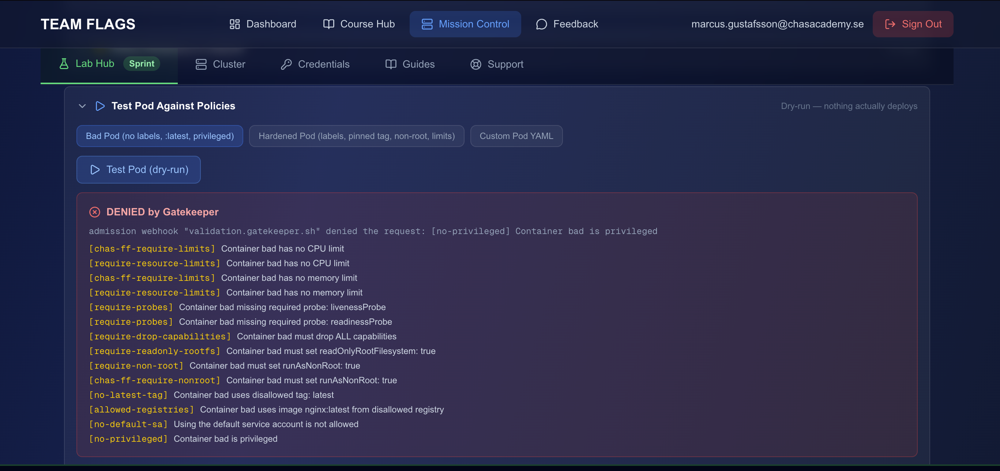
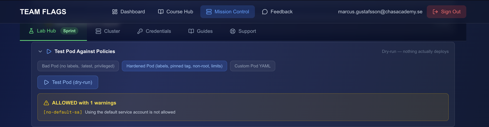
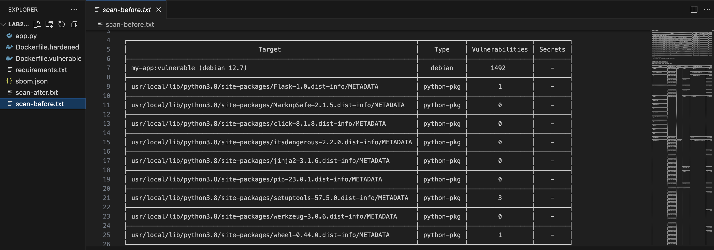
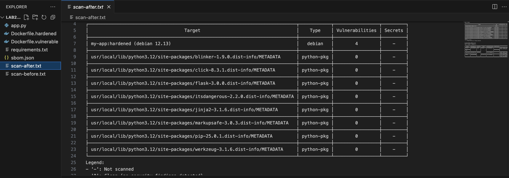

# Lab 2 – Container Security med Trivy och Gatekeeper

## Projektbeskrivning
I denna labb har vi undersökt container-säkerhet och Kubernetes policy enforcement. Vi byggde först en sårbar Docker-image och skannade den med Trivy. Därefter skapade vi en hardenad image och jämförde resultaten. Vi genererade även en SBOM och testade policy enforcement med Gatekeeper i Kubernetes.

## Verktyg som använts
- **Docker** – för att bygga och köra containers
- **Trivy** – för vulnerability scanning och SBOM
- **Python & Flask** – enkel webapp för labben
- **Kubernetes / Gatekeeper** – policy enforcement och säkerhetstest

## Screenshots

### Bad Pod

### Hardened Pod

### Scan Before

### Scan After

## Reflektion
Labben har visat hur viktigt det är med säkerhet i hela container-livscykeln, från base image till applikation. Sårbara images kan snabbt innehålla CVE:er, medan hardenade images med uppdaterade paket och non-root users minskar riskerna. Healthchecks och mindre images bidrar också till stabilitet och säkerhet.

SBOM är viktigt eftersom det ger en tydlig översikt över alla komponenter i en image, vilket underlättar vid compliance och snabba åtgärder när sårbarheter upptäcks. 

Gatekeeper tvingar team att följa policyer innan pods skapas, vilket gör säkerhet till en integrerad del av workflowen. Det förhindrar misstag och säkerställer att kubernetes-resurser alltid uppfyller företagets krav.

